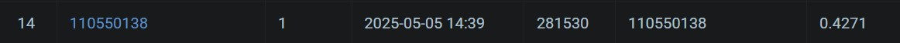

# NYCU VRDL spring 2025 HW3

Student ID: 110550138

Name: 鄭博文

## Introduction

A fine-tuned `maskrcnn_resnet50_fpn` model for cell image instance segmentation, with training and inference code.

## How to Run

### Install requirements:

  ```bash
  pip install -r requirements.txt
  ```

  Note that the package versions listed in the `requirements.txt` file have been tested only on Python 3.12. For older Python versions, consider removing the specified versions or manually resolving dependencies.

### Configuration:

  Check the comments in `config-example.yml`.

### Training:

  ```bash
  python train.py [--config <config_file_path>]
  ```
  The default value of `config` argument is `./config.yml`.

### Inference:

  ```
  python inference.py --checkpoint <checkpoint_name> [--config <config_file_path>]
  ```
  The checkpoint name should be the stem of `.pth` file in `MODEL_DIR`, with formate `{date}-{time}_epoch_{epoch}`. For example, `20250414-222522_epoch_4` (without .pth).

## Performance:

  AP@0.5: 0.42

  